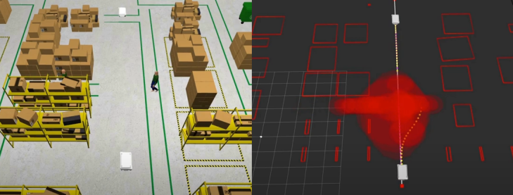

# Dynamic Obstacle Avoidance: One-shot Prediction (EBM) and Control (MPC)
To explore safer interactions between mobile robots and dynamic obstacles, this work presents a comprehensive approach to collision-free navigation in indoor environments. The proposed approach is an integration of multimodal motion predictions of dynamic obstacles and predictive control for obstacle avoidance. Motion prediction is achieved by an *energy-based* deep learning method that predicts plausible future positions. Model Predictive Control (MPC) solvers later generate collision-free trajectories for mobile robots.

**NOTE**: 
ROS2 Code is available: [ROS2 Gazebo Simulation](https://github.com/Woodenonez/DyObAv-MPCnEBM-Warehouse-ROS2)

## Publication
The [paper](https://ieeexplore.ieee.org/document/11021381) is published on RA-L.
Bibtex citation:
```
@ARTICLE{ze_2025_ebmmpc,
  author={Zhang, Ze and Hess, Georg and Hu, Junjie and Dean, Emmanuel and Svensson, Lennart and Åkesson, Knut},
  journal={IEEE Robotics and Automation Letters}, 
  title={Future-Oriented Navigation: Dynamic Obstacle Avoidance With One-Shot Energy-Based Multimodal Motion Prediction}, 
  year={2025},
  volume={10},
  number={8},
  pages={8043-8050},
  doi={10.1109/LRA.2025.3575969}
}

```



## Quick Start

### OpEn
The NMPC formulation is solved using open source implementation of PANOC, namely [OpEn](https://alphaville.github.io/optimization-engine/). Follow the [installation instructions](https://alphaville.github.io/optimization-engine/docs/installation) before proceeding. 

### Install dependencies
```
pip install -r requirements.txt
```

### Generate MPC solver
Go to "build_solver.py", use the proper configuration name **cfg_fname** and run
```
python solver_build.py
```
After this, a new directory *mpc_solver* will appear and contain the solver. Then, you are good to go :)

## Use Case
Run *main_base.py* for the warehouse simulation (different scenarios and methods) in Python. The evaluation is activated by setting the *evaluation* variable to **True**.

To watch the demo videos:
- ROS 2 and Gazebo simulation: [Link](https://youtu.be/j4n2mt0KdMY)
- Python long-term simulation: [Link](https://youtu.be/nNLAS4Hfgtk)
More videos from other projects are available on my [personal page](https://woodenonez.github.io/).

## ROS 2 Simulation
The ROS 2 (Humble) simulation is available in the following repository: [ROS2 Gazebo Simulation](https://github.com/Woodenonez/DyObAv-MPCnEBM-Warehouse-ROS2).
