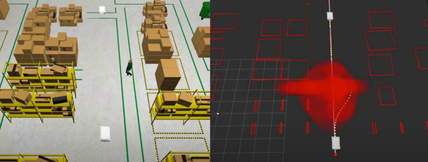

# Dynamic Obstacle Avoidance: One-shot Prediction (EBM) and Control (MPC)
To explore safer interactions between mobile robots and dynamic obstacles, this project presents a comprehensive approach to collision-free indoor navigation. The method integrates multimodal motion prediction for dynamic obstacles with predictive control for obstacle avoidance. Motion prediction is achieved with an *energy-based* deep learning method that estimates plausible future positions, and Model Predictive Control (MPC) then generates collision-free robot trajectories.

**NOTE**:
ROS 2 code is available here: [ROS2 Gazebo Simulation](https://github.com/Woodenonez/DyObAv-MPCnEBM-Warehouse-ROS2)

## Publication
The [paper](https://ieeexplore.ieee.org/document/11021381) is published in RA-L.
BibTeX citation:
```
@ARTICLE{ze_2025_ebmmpc,
  author={Zhang, Ze and Hess, Georg and Hu, Junjie and Dean, Emmanuel and Svensson, Lennart and Åkesson, Knut},
  journal={IEEE Robotics and Automation Letters}, 
  title={Future-Oriented Navigation: Dynamic Obstacle Avoidance With One-Shot Energy-Based Multimodal Motion Prediction}, 
  year={2025},
  volume={10},
  number={8},
  pages={8043-8050},
  doi={10.1109/LRA.2025.3575969}
}

```



## Quick Start

### OpEn
The NMPC formulation is solved using the open-source PANOC implementation, [OpEn](https://alphaville.github.io/optimization-engine/). Follow the [installation instructions](https://alphaville.github.io/optimization-engine/docs/installation) before proceeding.

### Install dependencies
There are two ways to install dependencies.

Recommended (modern setup with `uv`):
```
uv venv
uv pip install -e .
```

Legacy setup (older pinned environment):
```
pip install -r requirements.txt
```

### Generate MPC solver
Edit `cfg_fname` in `src/build_solver.py` if needed, then run from the repository root:
```
python src/build_solver.py
```
This generates/updates the solver artifacts under `mpc_solver/`.

## Use Case
Run `src/main_base.py` for the warehouse simulation (different scenarios and methods):
```
python src/main_base.py
```
Enable evaluation by setting `evaluation = True` near the entry point in `src/main_base.py`.

To watch the demo videos:
- ROS 2 and Gazebo simulation: [Link](https://youtu.be/j4n2mt0KdMY)
- Python long-term simulation: [Link](https://youtu.be/nNLAS4Hfgtk)

More videos from other projects are available on my [personal page](https://github.com/Woodenonez).

## ROS 2 Simulation
The ROS 2 (Humble) simulation is available in the following repository: [ROS2 Gazebo Simulation](https://github.com/Woodenonez/DyObAv-MPCnEBM-Warehouse-ROS2).
